# UTS

KELOMPOK 5 - MI 2C

## MOVIE APP

## HASIL FIGMA
Halaman Pertama
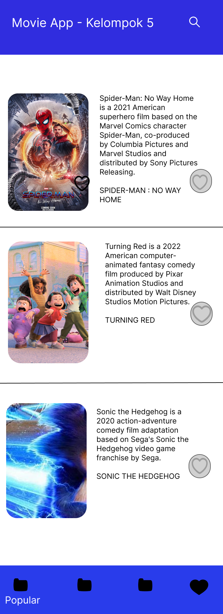

Halaman Kedua
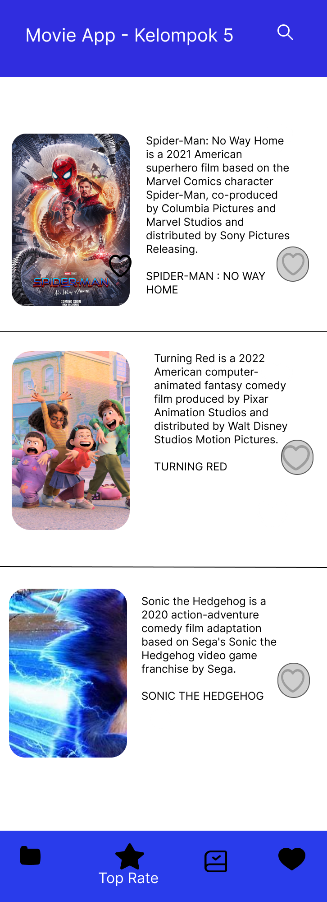

Halaman Ketiga
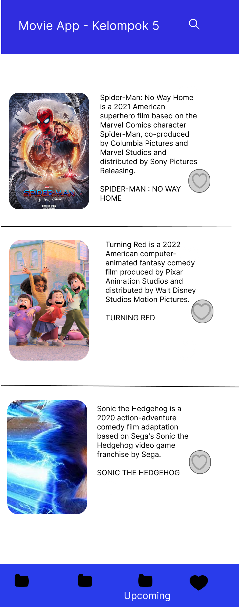

Halaman Keempat
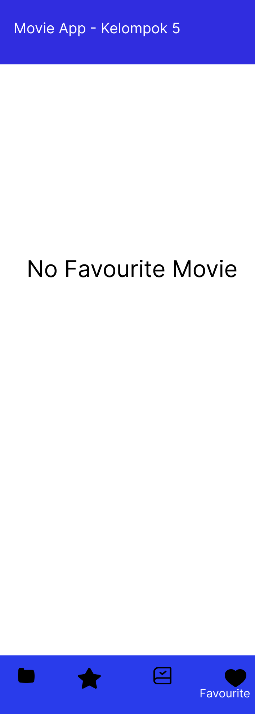

Halaman Coba Like
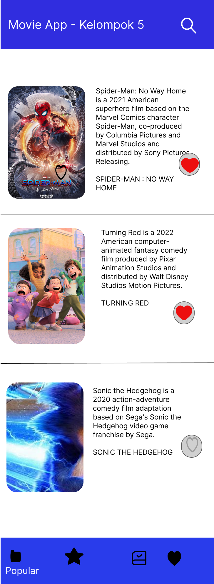

Halaman Hasil Like
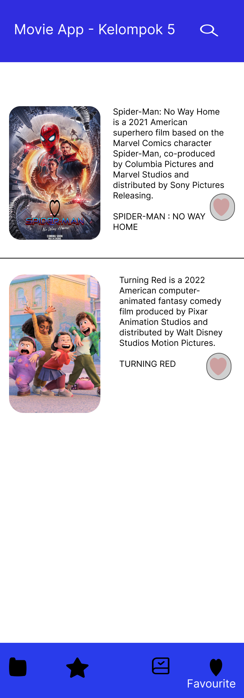

Halaman Detail Film
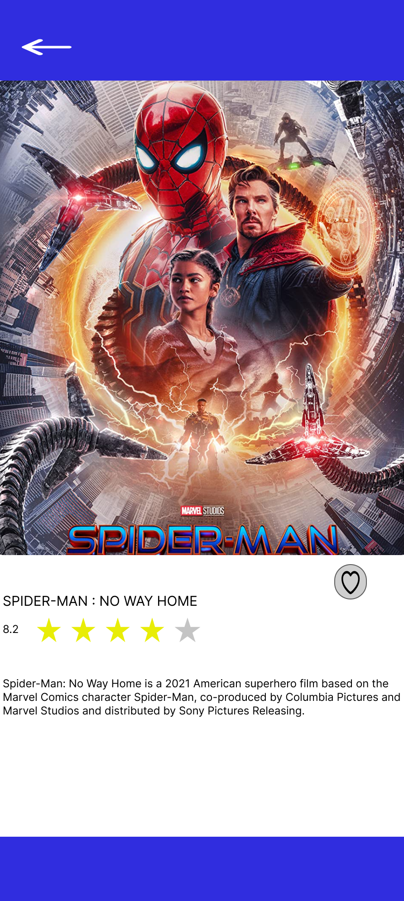

## HASIL PROGRAM

Halaman Pertama
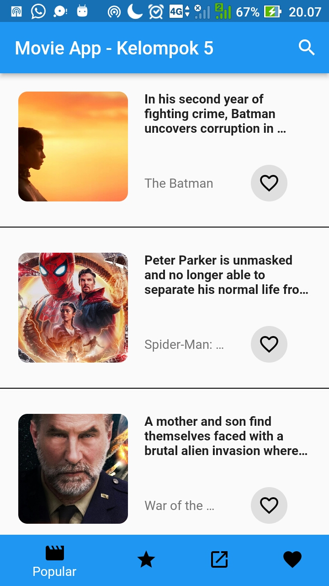

Halaman Kedua
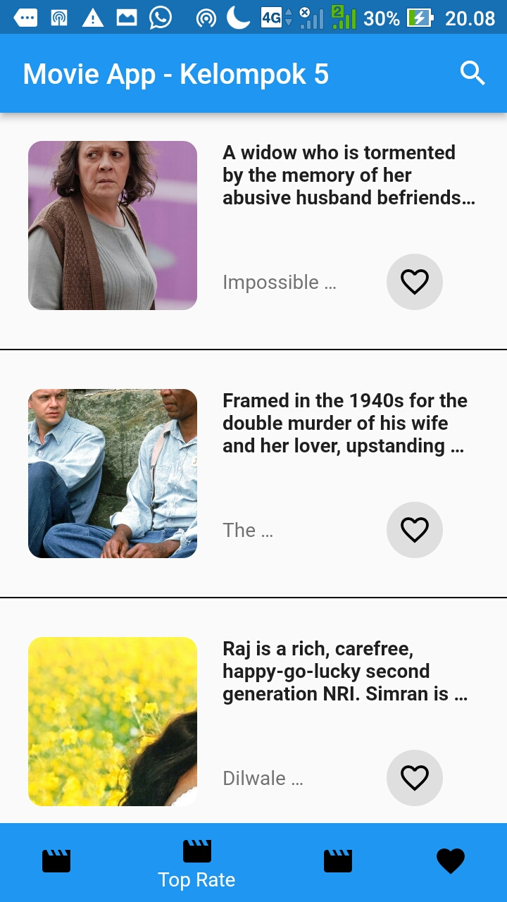

Halaman Ketiga
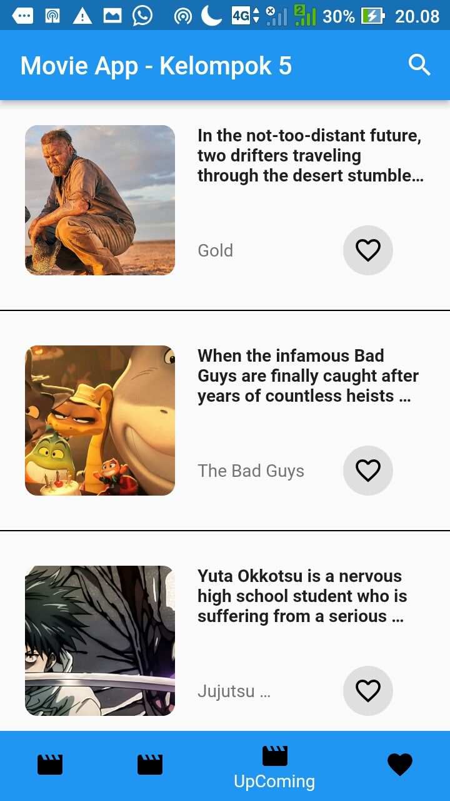

Halaman Keempat
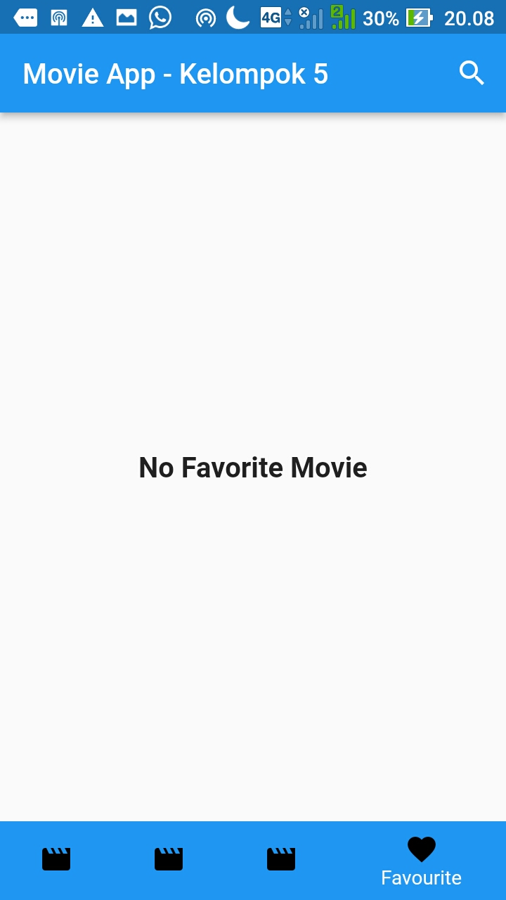

Halaman Show
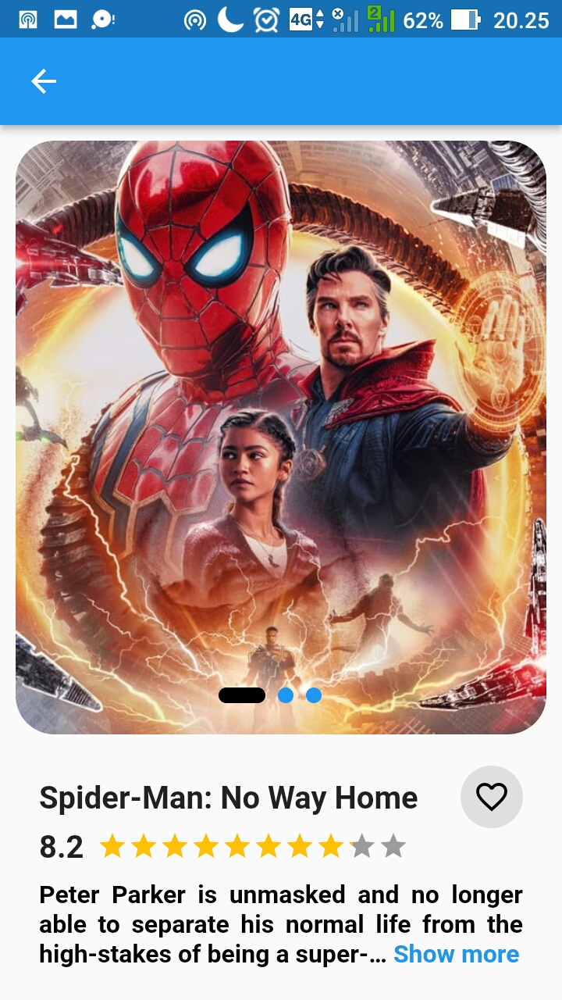
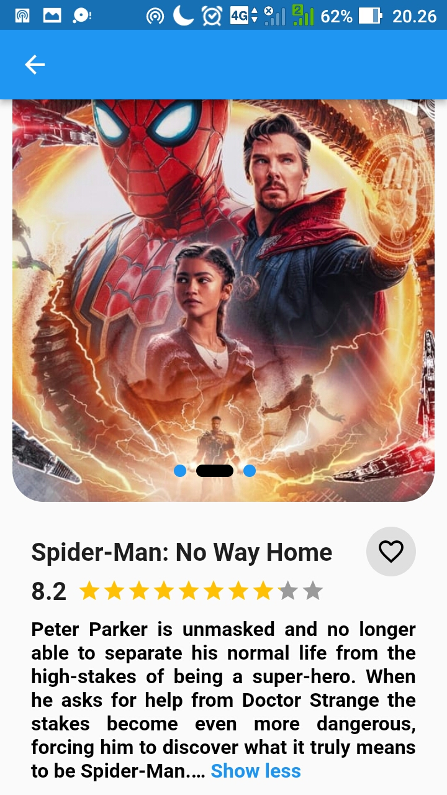

Halaman Like

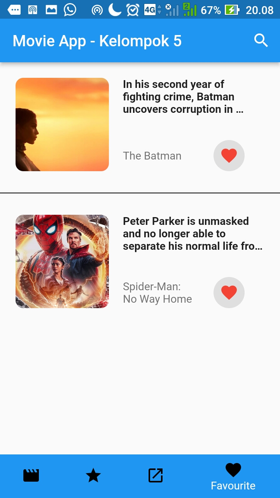
