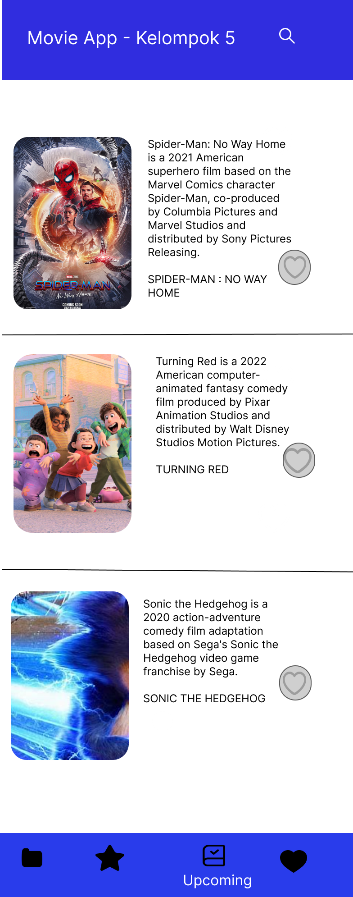
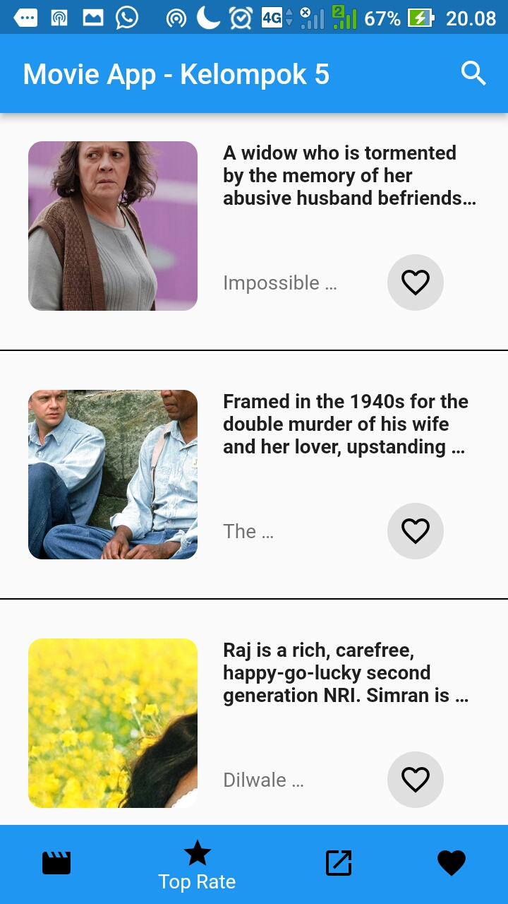

# UTS

KELOMPOK 5 - MI 2C

## MOVIE APP

## HASIL FIGMA
Halaman Pertama

Halaman Kedua

Halaman Ketiga

Halaman Keempat

Halaman Coba Like

Halaman Hasil Like

Halaman Detail Film

## HASIL PROGRAM

Halaman Pertama

Halaman Kedua

Halaman Ketiga

Halaman Keempat

Halaman Show

Halaman Like

